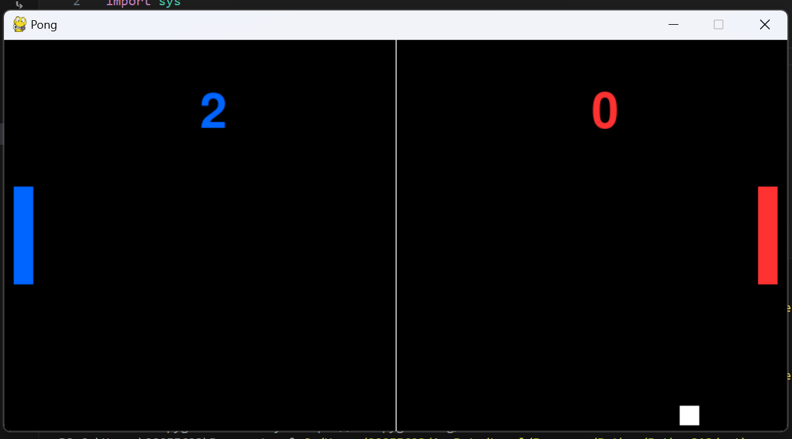
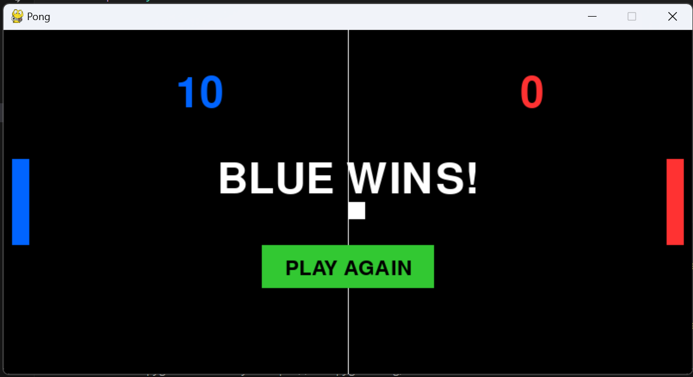

# Building a Classic Pong Game with Amazon Q Developer

## Introduction

In this blog post, I'll share my journey of recreating the classic arcade game Pong using Amazon Q Developer. I chose Pong as my retro game project because of its iconic status in gaming history and its relatively straightforward mechanics that make it perfect for exploring AI-assisted development.

## Why Pong?

Pong is one of the earliest arcade video games and helped establish the video game industry. Created by Atari in 1972, it simulates table tennis with simple 2D graphics. I selected Pong for several reasons:

1. **Fundamental Game Mechanics**: Pong demonstrates core gaming concepts like collision detection, scoring, and player input
2. **Visual Simplicity**: The minimalist design makes it achievable while still being recognizable
3. **Educational Value**: Building Pong covers essential programming concepts that apply to more complex games

## Effective Prompting Techniques

During development, I discovered several effective prompting strategies when working with Amazon Q:

### 1. Start with a Clear Goal

My initial prompt was direct and specific:
```
Can you make me a python game like pong
```

This gave Amazon Q a clear understanding of what I wanted to build.

### 2. Incremental Feature Requests

Rather than asking for everything at once, I built the game incrementally:
1. First, I requested the basic game structure
2. Then added scoring functionality
3. Added player colors for visual distinction
4. Finally added win conditions and a replay button

This step-by-step approach allowed Amazon Q to focus on one feature at a time, resulting in cleaner code.

### 3. Specific Enhancement Requests

When requesting enhancements, I used clear, concise language:
```
can you add score to my game
```
```
change it so that the different players are different colors
```
```
add a win condition if someone gets to 10 and a play again button
```

## How AI Handled Classic Programming Challenges

### Collision Detection

Amazon Q implemented collision detection for the ball with both paddles and the top/bottom walls:

```python
# Ball collision with top/bottom
if ball_y <= 0 or ball_y >= HEIGHT - 20:
    ball_dy = -ball_dy

# Ball collision with paddles
if (ball_x <= 30 and paddle1_y <= ball_y <= paddle1_y + 100) or \
   (ball_x >= WIDTH - 50 and paddle2_y <= ball_y <= paddle2_y + 100):
    ball_dx = -ball_dx
```

This solution elegantly handles the physics of the ball bouncing off surfaces.

### Game State Management

The AI implemented a clean solution for tracking game state:

```python
def reset_game():
    global paddle1_y, paddle2_y, ball_x, ball_y, ball_dx, ball_dy, score1, score2, game_over
    paddle1_y = paddle2_y = HEIGHT // 2 - 50
    ball_x, ball_y = WIDTH // 2, HEIGHT // 2
    ball_dx, ball_dy = 5, 3
    score1 = score2 = 0
    game_over = False
```

This function encapsulates all the variables that need to be reset when starting a new game.

## Development Automation Time-Savers

### 1. Complete Game Loop Generation

Amazon Q generated a complete game loop structure in one go, saving me from having to write boilerplate code:

```python
while True:
    for event in pygame.event.get():
        if event.type == pygame.QUIT:
            pygame.quit()
            sys.exit()
    
    # Game logic
    # ...
    
    # Drawing code
    # ...
    
    pygame.display.flip()
    clock.tick(60)
```

### 2. Automatic Dependencies Management

Amazon Q automatically created a requirements.txt file with the correct pygame version:

```
pygame==2.5.2
```

This saved me time researching compatible versions and setting up the environment.

## Interesting AI-Generated Solutions

### UI Element Creation

The play again button implementation was particularly elegant:

```python
# Draw play again button
button_rect = pygame.Rect(WIDTH//2 - 100, HEIGHT//2 + 50, 200, 50)
pygame.draw.rect(screen, GREEN, button_rect)
play_again = small_font.render("PLAY AGAIN", True, BLACK)
screen.blit(play_again, (WIDTH//2 - play_again.get_width()//2, HEIGHT//2 + 65))
```

Amazon Q centered the text perfectly within the button by calculating offsets based on text width.

### Mouse Interaction

The click detection for the play again button was implemented efficiently:

```python
if event.type == pygame.MOUSEBUTTONDOWN and game_over:
    # Check if play again button is clicked
    mouse_pos = pygame.mouse.get_pos()
    button_rect = pygame.Rect(WIDTH//2 - 100, HEIGHT//2 + 50, 200, 50)
    if button_rect.collidepoint(mouse_pos):
        reset_game()
```

## Final Game Screenshots


*Screenshot of the final Pong game with colored paddles and score display*


*Win screen showing the victory message and play again button*

## Conclusion

Building Pong with Amazon Q Developer demonstrated how AI can streamline game development while still teaching fundamental programming concepts. The incremental development approach worked particularly well, allowing me to build features progressively while maintaining clean code.

The final game includes all the classic Pong elements plus some modern enhancements like colored players, a proper scoring system, and a game reset feature. This project showcases how AI assistance can help developers quickly prototype and build functional games while still maintaining creative control over the development process.

## Next Steps

For those interested in extending this project further, consider adding:
- Sound effects for ball collisions and scoring
- A start menu with difficulty options
- AI opponent for single-player mode
- Power-ups that change ball speed or paddle size

Happy coding!
